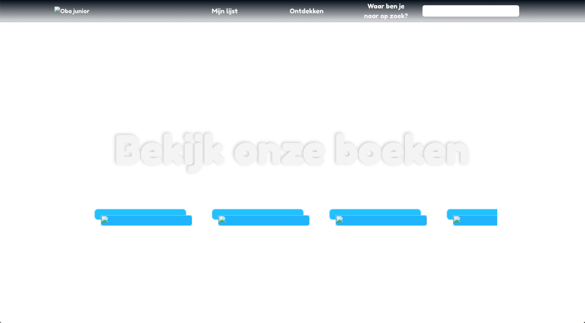
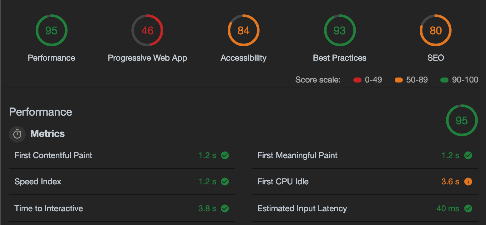

# Browser Technologies

**Enhance the performance of the Oba Project and define what can be improved and how you would improve this.**


## Table of Contents
* [Colors](#Colors)
* [Cookies](#Cookies)
* [Custom fonts](#Custom-fonts)
* [Images](#Images)  
* [Internet](#Internet)
* [Javascript](#Javascript)
* [Localstorage](#Localstorage)
* [Mouse and/or Trackpad](#Mouse-and/or-Trackpad)
* [Using a screenreader](#Using-a-screenreader)
* [License](#License)

## Colors

I used [Sim Daltonism](https://michelf.ca/projects/sim-daltonism/) to check if my application was compatible for people who are colorblind. Altough the colors are altered the user can still make out different components of the application. I also played with contrast and clarity.


## Cookies

In this application I didn't make any use of cookies, so there wasn't anything to improve. However if the user decided to disable cookies, localstorage would be automatically affected. Which in turn would make the whole application crash, if localstorage is not handled correctly. I disabled cookies by using an chrome extension called [Web Developer](https://chrome.google.com/webstore/detail/web-developer/bfbameneiokkgbdmiekhjnmfkcnldhhm?hl=nl). This tool allows me to disable thing like cookies, javascript, images, css, etc.


## Custom fonts

In this application I didn't make any use of custom fonts from the internet, however I did import a font in my files. If the user is able to turn of that custom font it will automatically go to the fallback, which is defined in css. 
```font-family: "Fredoka", Arial, Sans-serif;``` To detect if custom fonts are loaded and to turn them off you can use [Privacy Badger](https://chrome.google.com/webstore/detail/privacy-badger/pkehgijcmpdhfbdbbnkijodmdjhbjlgp?hl=nl) which is an extension in chrome.

## Images

When I turned of my images in the developer tools everything became invisible. 



First of because I used a white font on a dark background, but the background is an image. This was an easy fix, by setting a background-color in my css. The content that I showed from the api however a tad bit harder to fix. Mainly because I didn't set an alt attribute on the images. After I fixed this content was finally visible. There is no form of lazy loading right now, but when content is loading a loader is shown. I made the alt-text more visible by tweeking some things in my css.


## Internet

The performance is quite alright for this website. Eventough the Oba Api is like super slow. Mainly the images en fonts I used on the website take some time to load. This I tested with Audits in the inspector and by opening the responsive tool and setting the broadband to low-end.




## Javascript

When turning off Javascript with the developer tool the whole application breaks, because everything is build using Javascript even the content that is shown on the website is fetched by Javascript. So the user isn't able to do anything on the website when Javascript is turned off.

## Localstorage

Localstorage can be switched off by disabling cookies, how this is connected i've got no clue.
Right now when fetching content is automatically pushed towards Localstorage. When turned off the application breaks. However this is can be fixed, by not writing and fetching the data from Localstorage after an push.


## Mouse and/or Trackpad

To navigate without a mouse or trackpad the user is limited to using tab, enter or the spacebar.
Without an mouse or trackpad the user isn't able to navigate throughout this page with tab. Mainly because I linked my navigation to html elements, that aren't meant for navigation... For example images or articles. This is very bad practice. So I changed the way I had originally set up my navigation by adding anchor elements to the images or articles, so the proper HTML element is used for navigation. This took a lot of time, but in the end I fanlly managed to fix this. 


## Using a screenreader

To activate the screenreader on Mac press ```command, option + f5```. When activating the screen the home page works properly, however on the next page I run into several problem. I added an eventListener to an article, which is why the screenreader skips over those elements, therefore the user isn't able to access those elements to navigate to the next page. When changing the article elements to buttons, the user will be able to navigate properply in the application.


## Device Lab

The device lab was broken multiple times, which made testing my application quite difficult. In the end I decided to test out 2 devices by just inserting the link to my oba application in the browser to test it out, because in the end it still wasn't working. What I noticed on those two devices was the following:

*   I didn't add mediaqueries to my styles, so the whole layout was one big mess.
*   Content doesn't load properly, this could be due to the fact that Javascript was disabled, but I don't know for sure. If that is the case it explains, why links are not working, because I also handled this with Javascript, which is definitely bad practise.


## License
This repository is licensed as [MIT](LICENSE) by [Chelsea Doeleman](https://github.com/chelseadoeleman).

